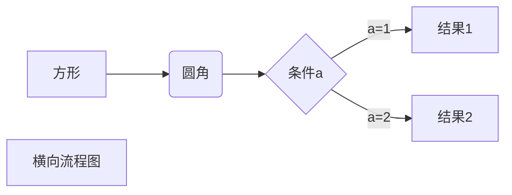
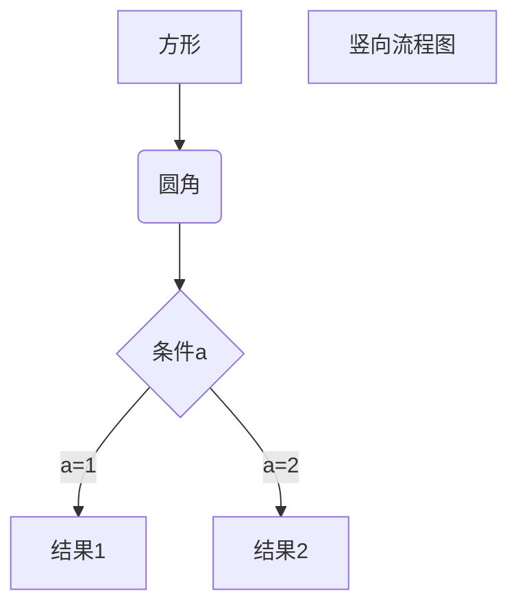
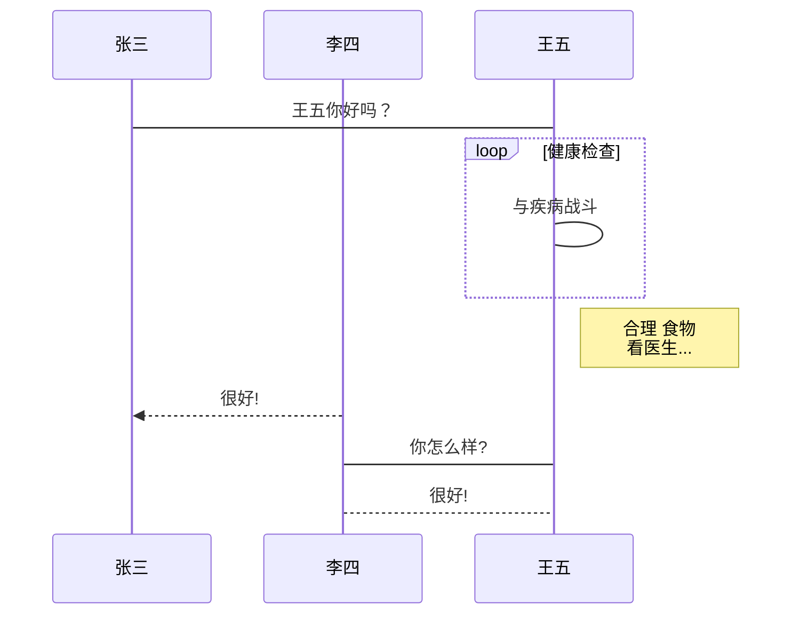

```
一级标题
=======
二级标题
-------

# 一级标题
## 二级标题
### 三级标题
#### 四级标题
##### 五级标题
###### 六级标题

## Markdown 段落
Runoob.com  

Google.com

### 字体

*斜体字体*
**粗体**
***斜粗体***

### 分割线
***

*******

### 删除线

~~baidu.com~~ `双波浪线是英文字符`

### 下划线

<u>带下划线</u>

### 脚注

格式 [^要注明的文本]

创建脚注格式类似这样[^RunooB]
[^RunooB]: 菜鸟教程 -- 早点歇息

## Markdown 列表

##### 无序
* 第一
* 第二
* 第三
  
+ 第一
+ 第二
+ 第三

- 第一
- 第二
- 第三

##### 有序
1. 第一
2. 第二
3. 第三
   
##### 列表嵌套
1. 第一项
   * 第一项嵌套的第一个元素
   * 第一项嵌套的第二个元素
2. 第二项
   * 第二项嵌套的第一个元素
   * 第二项嵌套的第二个元素

## Markdown 区块
> 区块引用
> 菜鸟教程
> 学的不仅是技术更是梦想

##### 区块嵌套
> 最外层
> > 第一层嵌套
> > > 第二层嵌套

##### 区块中列表
> 1. 第一项
> 2. 第二项
> * 第一项
> * 第二项
> * 第三项

##### 列表中使用区块

* 第一项
  > 菜鸟教程
  > 学的不仅是技术更是梦想
* 第二项

## Markdown 代码

`printf()` 函数

    <?php
    echo 'RUNOOB';
    function test(){
        echo 'test'
    }
可以指定一种语言或者不指定
```javascript
$(document).ready(function()){
    alert('RUNOOB');
});
```
```
```python
print("hello world")
```
```
## Markdown 链接

##### 格式

[链接名称](链接地址)

这个是一个链接 [菜鸟教程](https://runoob.com)

直接使用链接
<https://runoob.com>

##### 高级链接

这个链接用 1 作为网址变量 [Google][1]
这个链接用 runoob 作为网址变量 [Runoob][runoob] 
注意至少空一行

[runoob]:http://www.runoob.com
[1]:http://www.google.com/

## Markdown 图片

##### 格式


使用实例：


图片地址引用：

这个链接用 1 作为网址变量[RUNOOB][2]

[2]:http://static.runoob.com/images/runoob-logo.png

**指定图片的高度 宽度**


## Markdown 表格

Markdown 制作表格使用 | 来分隔不同的单元格 使用 - 来分隔表头和其它行

|表头|表头|
|-|-|
|单元格|单元格|
|单元格|单元格|

对齐方式：
* -: 设置右对齐 
* :- 设置左对齐
* :-: 设置居中对齐

|左对齐|右对齐|居中对齐|
|:-|-:|:-:|
|单元格|单元格|单元格|
|单元格|单元格|单元格|

## Markdown 高级技巧

支持的**HTML**元素

目前支持的HTML元素有： `<kbd> <b> <i> <em> <sup> <sub> <br>` 等

使用<kbd>Ctrl</kbd>+<kbd>Alt</kbd>+<kbd>Del</kbd> 重启电脑

><i> 斜体</i>
<em>斜体</em>
图片<sup>上移动</sup>
图片<sub>下移动</sub>
`<br>我换行了`

<br>我换行了 

##### **加反斜杆转义特殊字符**

>\*\* 正常显示星号 \*\*

**Markdown 支持以下符号加上反斜杠变成普通字符**

>\\反斜线
\` 反引号
>\* 星号
>\_ 下划线
>\{} 花括号
>\[] 方括号
>\() 小括号
>\# 井字号
>\+ 加号
>\- 减号
>\. 英文句号
>\! 感叹号

**1. 横向流程图源码格式：**

```
**2. 竖向流程图源码格式：**

```
**3. 标准流程图源码格式：**
```flow
st=>start: 开始框
op=>operation: 处理框
cond=>condition: 判断框(是或否?)
sub1=>subroutine: 子流程
io=>inputoutput: 输入输出框
e=>end: 结束框
st->op->cond
cond(yes)->io->e
cond(no)->sub1(right)->op
```
```
**4. 标准流程图源码格式（横向）：**
```flow
st=>start: 开始框
op=>operation: 处理框
cond=>condition: 判断框(是或否?)
sub1=>subroutine: 子流程
io=>inputoutput: 输入输出框
e=>end: 结束框
st(right)->op(right)->cond
cond(yes)->io(bottom)->e
cond(no)->sub1(right)->op
```
```
**5. UML时序图源码样例：**
```sequence
对象A->对象B: 对象B你好吗?（请求）
Note right of 对象B: 对象B的描述
Note left of 对象A: 对象A的描述(提示)
对象B-->对象A: 我很好(响应)
对象A->对象B: 你真的好吗？
```
```
**6. UML时序图源码复杂样例：**
```sequence
Title: 标题：复杂使用
对象A->对象B: 对象B你好吗?（请求）
Note right of 对象B: 对象B的描述
Note left of 对象A: 对象A的描述(提示)
对象B-->对象A: 我很好(响应)
对象B->小三: 你好吗
小三-->>对象A: 对象B找我了
对象A->对象B: 你真的好吗？
Note over 小三,对象B: 我们是朋友
participant C
Note right of C: 没人陪我玩
```
```
**7. UML标准时序图样例：**

```
